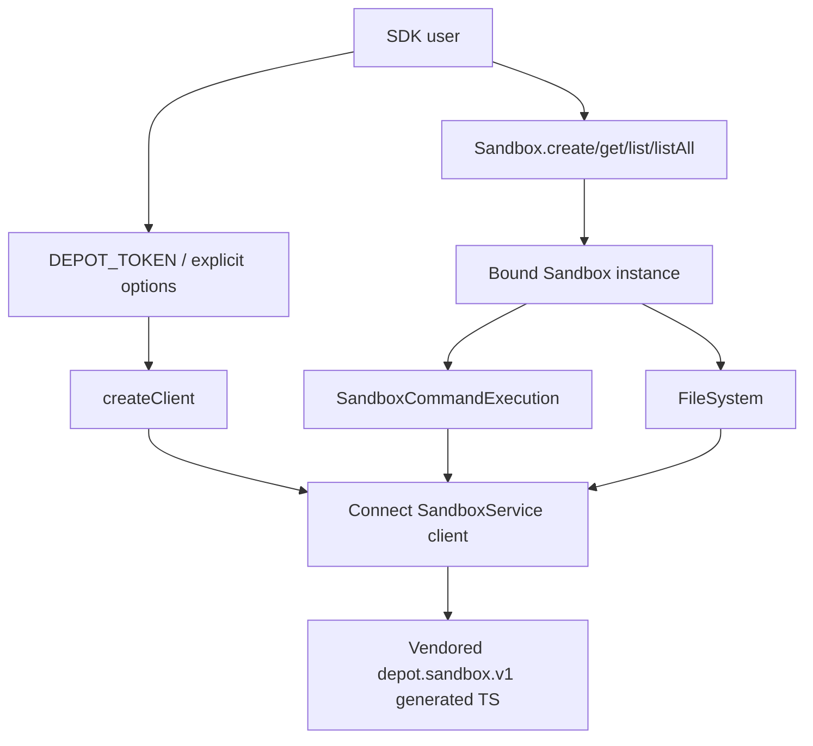

# feat: Add sandbox SDK package

## Overview

Build `github.com/depot/sandbox-sdk` into the beta npm package home for `@depot/sandbox`. The repo is currently a skeleton with only `README.md` and `LICENSE`, so this plan creates the TypeScript package scaffold, moves the reviewed sandbox SDK source into it, vendors the generated `depot.sandbox.v1` TypeScript client files needed for beta distribution, and adds repo-local validation.

The implementation should preserve the API PR's instance-owned client surface: callers create or provide a sandbox client once, static entry points return `Sandbox` instances bound to that client, and instance methods such as `stop`, `kill`, `runCommand`, and `fs` do not require the caller to pass a client again. The active source of truth is the user override recorded in the DEP-4140 task note: the package moves into `sandbox-sdk`, not `sdk-node`.

---

## Problem Frame

DEP-4140 asks Depot to publish a deliberately beta `@depot/sandbox` npm package so pilot customers can test the SDK v0 surface. The Linear description still names `github.com/depot/sdk-node`, but this workstream intentionally redirects the move to `github.com/depot/sandbox-sdk`.

The useful SDK work already exists in two places: `depot/api` contains the reviewed `sdk-sandbox` source and PR #3881's client-binding refactor, while the superseded `depot/sdk-node` PR #29 shows how that source was packaged as `packages/sandbox`. This plan turns those references into a standalone, TS/JS-only package repo without adding Go, CLI binaries, server code, or production database interaction.

---

## Requirements Trace

- R1. Create a standalone TypeScript/JavaScript npm package named `@depot/sandbox` in `sandbox-sdk`.
- R2. Preserve the reviewed `depot.sandbox.v1` SDK public surface from the API client-classes work: client creation, sandbox lifecycle helpers, command execution, streaming output, and filesystem helpers.
- R3. Keep the SDK pure TS/JS with no Go CLI, binary dependency, or server-side API implementation.
- R4. Bundle or vendor the generated `depot.sandbox.v1` TypeScript client code so beta consumers do not need a separate published proto module.
- R5. Align auth behavior with ticket intent: `DEPOT_TOKEN` should be the natural default path, while explicit token, endpoint, organization, and client configuration remain available.
- R6. Publish-ready package metadata must target the new `depot/sandbox-sdk` repository and beta package lifecycle, not the superseded `sdk-node` location.
- R7. Add repo-local build, type-check, format, and test validation scripts that cover the package before publication.
- R8. Document beta scope and non-goals so pilot customers understand the supported surface and deferred capabilities.

---

## Scope Boundaries

- This plan does not publish `@depot/sandbox` to npm during implementation.
- This plan does not add release automation; release CI can be planned separately once the package exists in `sandbox-sdk`.
- This plan does not change server API behavior or proto definitions in `depot/api`.
- This plan does not add Go, Depot CLI integration, Docker images, or binary installation.
- This plan does not access production databases or inspect production credentials.
- This plan does not clean up or remove the superseded `sdk-node` package unless a follow-up explicitly scopes that work.

### Deferred to Follow-Up Work

- Release automation for `sandbox-sdk`: add GitHub Actions/npm trusted publishing after the package scaffold and validation are in place.
- API repo cleanup: remove or deprecate `sdk-sandbox/` from `depot/api` only after the standalone package is merged and downstream references are updated.
- npm first-publish operations: configure package ownership, trusted publisher settings, and the first beta release outside this implementation plan.

---

## Context & Research

### Relevant Code and Patterns

- `depot/api` `sdk-sandbox/src` is the authoritative reviewed SDK source, with `dep-4140-client-classes` history ending in `refactor(sdk-sandbox): bind clients to sandbox instances`.
- `depot/sdk-node` PR #29 shows the package shape that previously moved the SDK under `packages/sandbox`, including package metadata, TypeScript configs, vendored generated files, README, and Node test coverage.
- `depot/sdk-node` package scripts provide a useful pnpm pattern: root aggregate scripts run package build/type-check/test commands, while the sandbox package builds with `tsc` and tests with `tsx --test`.
- The current `sandbox-sdk` repo has no local package manager, package manifest, test framework, or docs structure, so implementation should establish the minimal standalone package conventions rather than a monorepo package layout.
- The generated sandbox proto files in the reference package live under `src/gen/depot/sandbox/v1` and are imported through relative `.js` ESM paths from SDK source.

### Institutional Learnings

- No repo-local `docs/solutions/` learnings are present in `sandbox-sdk`.

### External References

- npm package metadata docs confirm publishable packages need unique `name` and `version` fields and document package fields such as `files`, `exports`, `engines`, and `publishConfig`: https://docs.npmjs.com/cli/v11/configuring-npm/package-json/
- Node package docs recommend explicit `"type"` in `package.json` and describe `"exports"` as the package entry-point contract used by Node: https://nodejs.org/api/packages.html
- TypeScript module-resolution docs state that modern module resolution follows Node package `"exports"` and that published typed packages should include a `"types"` field for registry/type discovery: https://www.typescriptlang.org/docs/handbook/modules/reference.html
- Connect-ES documents `@connectrpc/connect` and `@connectrpc/connect-node` as the TypeScript/Node Connect packages used for RPC clients and transports: https://github.com/connectrpc/connect-es

---

## Key Technical Decisions

- Use a standalone package layout at repo root: `sandbox-sdk` is dedicated to this package, so `package.json`, `src/`, `tsconfig.json`, and validation scripts should live at the root instead of recreating the `sdk-node` `packages/sandbox` nesting.
- Preserve the API PR source as the behavioral baseline, then use the `sdk-node` PR package files as packaging guidance: the API repo carries the reviewed client-class behavior, while `sdk-node` adds publishable package metadata and standalone tests.
- Keep ESM-only output for beta: the reference package already uses `"type": "module"`, `main`, `exports.import`, and `types`; matching that avoids inventing a dual CJS/ESM build for v0.
- Use TypeScript declarations emitted by `tsc`: this is sufficient for a TS/JS SDK with no bundling requirement and keeps generated proto imports transparent.
- Treat generated `depot.sandbox.v1` files as vendored source for beta: this satisfies DEP-4140's "bundle generated client" intent while avoiding a dependency on a separate proto package.
- Add a default environment-token path in `createClient` without removing explicit token configuration: `DEPOT_TOKEN` should work naturally for examples and local use, while tests should prove explicit token precedence and missing-token errors.
- Keep validation local and lightweight: use Node's built-in test runner through `tsx`, TypeScript strict checking, and Prettier formatting rather than introducing a heavier test framework.

---

## Open Questions

### Resolved During Planning

- Which repo is the implementation target? `sandbox-sdk`, because the user's explicit override supersedes the Linear description's `sdk-node` destination.
- Should the package be nested under `packages/sandbox`? No. The target repo exists specifically for this SDK, so a root package is simpler and avoids unnecessary workspace shape.
- Should generated sandbox protos be published through a separate module first? No. DEP-4140 allows vendored generated client code for the beta package.
- Should this implementation include release CI? No. Release automation is important, but it depends on a real package scaffold and is better as a follow-up plan.

### Deferred to Implementation

- Exact dependency versions: start from the references, then choose compatible current versions during implementation based on install resolution and generated-code compatibility.
- Exact generated proto source: prefer copying the generated files used by the reviewed SDK; regenerate only if implementation finds the checked-in generated output is stale against the source protos and the required generator path is available.
- Exact package version: use the beta version from the reference package unless maintainers require a newer prerelease before publication.
- Whether `DEPOT_ORG_ID` should also be read automatically: implement only if it fits the existing client options without surprising precedence; otherwise document `orgID` as explicit configuration.

---

## Output Structure

    .github/
      workflows/
        ci.yml
    docs/
      plans/
        2026-06-09-001-feat-sandbox-sdk-package-plan.md
    src/
      gen/
        depot/
          sandbox/
            v1/
              command_pb.ts
              filesystem_pb.ts
              refs_pb.ts
              sandbox_pb.ts
      client.ts
      client.test.ts
      command.ts
      command.test.ts
      errors.ts
      filesystem.ts
      filesystem.test.ts
      index.ts
      k-streaming.ts
      k-streaming.test.ts
      sandbox.ts
      sandbox.test.ts
      types.ts
    package.json
    pnpm-lock.yaml
    tsconfig.json
    tsconfig.build.json
    CHANGELOG.md
    README.md

---

## High-Level Technical Design

> _This illustrates the intended approach and is directional guidance for review, not implementation specification. The implementing agent should treat it as context, not code to reproduce._

---

## Implementation Units

- U1. **Establish the standalone TypeScript package scaffold**

**Goal:** Turn the skeleton repository into a standalone `@depot/sandbox` TypeScript package with package manager, compiler, formatter, test, and CI conventions.

**Requirements:** R1, R3, R6, R7

**Dependencies:** None

**Files:**

- Create: `package.json`
- Create: `pnpm-lock.yaml`
- Create: `tsconfig.json`
- Create: `tsconfig.build.json`
- Create: `.gitignore`
- Create: `.prettierignore`
- Create: `.github/workflows/ci.yml`

**Approach:**

- Put the npm package at repo root with `name: @depot/sandbox`, ESM module metadata, declaration output, beta publish config, and repository metadata pointing to `https://github.com/depot/sandbox-sdk`.
- Use `pnpm` as the package manager to match Depot's existing SDK references and lock dependencies once implementation installs them.
- Start from the reference package's TypeScript build/test scripts, adjusted for root-level paths.
- Add CI that installs dependencies and runs formatting, type-check, tests, and build on pushes and pull requests, without adding release or publish steps.
- Keep the scaffold TS/JS-only; do not add Go, Docker, binary, or API-server tooling.

**Patterns to follow:**

- `depot/sdk-node` root `package.json` for pnpm, Prettier, and aggregate validation style.
- `depot/sdk-node` `packages/sandbox/package.json` for package metadata, beta publish config, and sandbox-specific scripts.
- `depot/sdk-node` `packages/sandbox/tsconfig*.json` for TypeScript compiler boundaries.

**Test scenarios:**

- Test expectation: none -- this unit is package/config scaffolding. Validation is through script execution and CI YAML review rather than unit tests.

**Verification:**

- `package.json` describes a publishable public beta `@depot/sandbox` package from `depot/sandbox-sdk`.
- TypeScript output is configured for `dist/` with declarations and no source emission into tracked source paths.
- CI validates install, format, type-check, tests, and build without publishing.

---

- U2. **Move the reviewed SDK source and vendored generated client**

**Goal:** Add the SDK implementation and generated `depot.sandbox.v1` TypeScript files to the standalone repo.

**Requirements:** R2, R3, R4

**Dependencies:** U1

**Files:**

- Create: `src/index.ts`
- Create: `src/client.ts`
- Create: `src/sandbox.ts`
- Create: `src/command.ts`
- Create: `src/filesystem.ts`
- Create: `src/errors.ts`
- Create: `src/k-streaming.ts`
- Create: `src/types.ts`
- Create: `src/gen/depot/sandbox/v1/command_pb.ts`
- Create: `src/gen/depot/sandbox/v1/filesystem_pb.ts`
- Create: `src/gen/depot/sandbox/v1/refs_pb.ts`
- Create: `src/gen/depot/sandbox/v1/sandbox_pb.ts`
- Test: `src/sandbox.test.ts`
- Test: `src/command.test.ts`
- Test: `src/filesystem.test.ts`
- Test: `src/k-streaming.test.ts`

**Approach:**

- Copy SDK source from the reviewed `depot/api` `sdk-sandbox/src` baseline, applying the package-ready cleanup already represented in the superseded `sdk-node` PR where it only affects comments, import ordering, TS compatibility, or package isolation.
- Copy only generated sandbox v1 client files required by the public SDK. Do not copy broader API generated clients from `sdk-node` unless the sandbox source actually imports them.
- Keep imports ESM-compatible with `.js` specifiers so emitted output works under `"type": "module"`.
- Preserve the public export surface from the reference `index.ts`; do not expose generated proto modules as part of the top-level API unless a public SDK type requires it.
- Bring over the reference unit tests as characterization coverage before changing behavior.

**Execution note:** Add or preserve characterization tests before making package-specific source edits so the move does not accidentally change the reviewed SDK surface.

**Patterns to follow:**

- `depot/api` `sdk-sandbox/src` for reviewed SDK behavior.
- `depot/sdk-node` `packages/sandbox/src` for package-isolated source layout and generated-file placement.

**Test scenarios:**

- Happy path: creating, getting, listing, and listing all sandboxes returns `Sandbox` instances populated from proto responses.
- Happy path: `sandbox.stop`, `sandbox.kill`, `sandbox.runCommand`, and `sandbox.fs` use the client captured by the `Sandbox` instance.
- Happy path: command execution consumes Started, stdout/stderr, and Finished events into accessors, `logs()`, `output()`, and `wait()`.
- Happy path: filesystem helpers send requests against the bound sandbox and map read/write/stat/readdir responses into Node-shaped values.
- Edge case: sandboxes returned from different clients keep using their originating clients for later instance calls.
- Edge case: command output handles multiple consumers, partial UTF-8 chunks, stdout/stderr filtering, and detached command accessors.
- Error path: command streams that emit errors or close without Finished surface failures instead of hanging or falsely succeeding.
- Error path: filesystem Connect errors with and without detail map to `FileSystemError` with Node-shaped `code`, `errno`, `syscall`, and `path`.
- Integration: source imports compile against the vendored generated files without requiring any `depot/api` or `sdk-node` package dependency.

**Verification:**

- The package builds from root source with no imports from outside this repo.
- Tests prove the moved SDK behavior matches the reviewed references.
- Generated files are present under `src/gen/depot/sandbox/v1` and are included in TypeScript compilation.

---

- U3. **Align auth and client configuration for standalone beta use**

**Goal:** Make client creation natural for beta users by supporting `DEPOT_TOKEN` as the default token source while preserving explicit configuration.

**Requirements:** R2, R5, R8

**Dependencies:** U2

**Files:**

- Modify: `src/client.ts`
- Modify: `src/index.ts`
- Test: `src/client.test.ts`
- Modify: `README.md`

**Approach:**

- Keep `createClient` as the primary entry point and continue returning an opaque `SandboxClient` wrapping the Connect client.
- Allow callers to omit `token` when `process.env.DEPOT_TOKEN` is set, while explicit `token` takes precedence over the environment.
- Preserve explicit `endpoint` and `orgID` options; if an organization environment default is added, document and test precedence clearly.
- Keep auth header behavior unchanged: requests set `Authorization: Bearer <token>` and set `x-depot-org` only when an organization ID is configured.
- Keep missing-token failures explicit and early so pilot customers get a clear setup error.

**Patterns to follow:**

- `depot/api` `sdk-sandbox/src/client.ts` for Connect transport and authorization-header behavior.
- `depot/sdk-node` `packages/sandbox/README.md` for `DEPOT_TOKEN`-first examples.

**Test scenarios:**

- Happy path: `createClient({token: "explicit"})` uses the explicit token and default endpoint.
- Happy path: `createClient()` uses `DEPOT_TOKEN` when present.
- Edge case: explicit `token` overrides `DEPOT_TOKEN` when both are present.
- Edge case: custom `endpoint` is retained on the returned client.
- Edge case: configured `orgID` adds `x-depot-org`, while absent `orgID` leaves the header unset.
- Error path: calling `createClient()` without an explicit token or `DEPOT_TOKEN` throws a clear missing-token error.

**Verification:**

- Client creation works for both environment-based and explicit-token examples.
- Existing SDK calls still receive the same RPC client shape expected by `Sandbox` and child objects.

---

- U4. **Document the beta package surface and publish boundaries**

**Goal:** Replace the skeleton README with customer-facing package usage docs and metadata notes that match the standalone repo.

**Requirements:** R5, R6, R8

**Dependencies:** U2, U3

**Files:**

- Modify: `README.md`
- Modify: `package.json`
- Create: `CHANGELOG.md`

**Approach:**

- Document installation with the beta dist-tag, `DEPOT_TOKEN` setup, basic sandbox creation, command execution, output collection, filesystem usage, and cleanup.
- Document explicit client options for endpoint and organization selection without making them required for the common case.
- List the beta-supported surface: `createClient`, lifecycle static methods, instance lifecycle methods, command streaming/output helpers, and filesystem helpers.
- List deferred capabilities from the reference README, such as piped stdin, command history, create-time secrets, timeout extension, snapshots, and pty support.
- Ensure package metadata does not mention `sdk-node` as the repository location or package directory.
- Add a minimal changelog entry for the initial beta package scaffold.

**Patterns to follow:**

- `depot/sdk-node` `packages/sandbox/README.md` for beta surface wording.
- npm package metadata docs for publish-facing package fields.

**Test scenarios:**

- Test expectation: none -- this unit is documentation and package metadata. Validate by package metadata review and generated package contents inspection.

**Verification:**

- README examples match the implemented API and compile conceptually against the public exports.
- Metadata points to `depot/sandbox-sdk` and includes package fields expected for a typed ESM npm package.
- Deferred beta capabilities are explicit and not presented as supported.

---

- U5. **Add package contents and validation checks for release readiness**

**Goal:** Make it possible to verify the package locally before any future release automation or npm publish.

**Requirements:** R6, R7

**Dependencies:** U1, U2, U3, U4

**Files:**

- Modify: `package.json`
- Modify: `.github/workflows/ci.yml`
- Test: `src/*.test.ts`

**Approach:**

- Add scripts that make local validation explicit: format check, type-check, tests, build, and a package contents dry-run.
- Ensure `files` includes only `dist` and necessary package metadata in the published tarball; do not publish source, tests, local docs plans, or generated build artifacts outside `dist`.
- Add a `prepack` build hook so `pnpm pack` produces current output.
- Keep publication itself out of scope; any `publishConfig` should be declarative metadata only.
- Verify generated declarations preserve the public API and that package entry points resolve from the packed output.

**Patterns to follow:**

- `depot/sdk-node` `packages/sandbox/package.json` for `files`, `exports`, `types`, `prepack`, and beta publish config.
- Node and TypeScript package docs for ESM entry points, `exports`, and declaration discovery.

**Test scenarios:**

- Happy path: package build emits `dist/index.js` and `dist/index.d.ts`.
- Happy path: root test script runs all SDK tests under `src`.
- Integration: package dry-run includes compiled runtime files and declarations but excludes tests and source-only planning docs.
- Integration: importing the packed package entry point resolves the public exports from `dist`.
- Error path: CI fails if formatting, type-checking, tests, build, or package contents validation fail.

**Verification:**

- A clean checkout can install dependencies, run validation scripts, build, and dry-run package contents without external repos.
- The package is ready for a separate release-automation task without hidden setup work.

---

## System-Wide Impact

- **Interaction graph:** SDK users call public helpers in `src/index.ts`; those helpers create Connect RPC clients from vendored generated service descriptors and bind them into `Sandbox`, `SandboxCommandExecution`, and `FileSystem` objects.
- **Error propagation:** Client construction should fail early for missing auth; RPC failures propagate through Connect errors except filesystem calls, which map server details into Node-shaped `FileSystemError`.
- **State lifecycle risks:** Command execution depends on correct stream lifecycle handling. Tests must cover Started-first assumptions, background draining, terminal settling, detached command behavior, and stream cleanup on errors.
- **API surface parity:** The standalone package should preserve the reviewed API PR surface and not silently add or remove exports during the repo move.
- **Integration coverage:** Unit tests with fake RPC clients prove object binding and request shapes; package build and pack checks prove the source no longer depends on `api` or `sdk-node`.
- **Unchanged invariants:** Server API definitions, generated proto semantics, and sandbox service behavior are unchanged. This repo consumes the current generated client files but does not define the server contract.

---

## Risks & Dependencies

| Risk                                                                                   | Mitigation                                                                                                                                                                   |
| -------------------------------------------------------------------------------------- | ---------------------------------------------------------------------------------------------------------------------------------------------------------------------------- |
| The moved package accidentally follows the superseded `sdk-node` destination metadata. | Review `package.json`, README, and repository fields for `depot/sandbox-sdk`; include metadata checks in U4/U5.                                                              |
| The API and `sdk-node` references differ in subtle ways.                               | Treat `depot/api` PR #3881 as behavioral source of truth and `sdk-node` PR #29 as packaging source; preserve characterization tests before package-specific edits.           |
| Vendored generated files become stale relative to API protos.                          | Use the generated files that match the reviewed SDK baseline, and defer regeneration unless implementation can verify generator compatibility and source proto availability. |
| Environment-token defaults create ambiguous auth precedence.                           | Test explicit-token precedence, environment fallback, and missing-token errors in `src/client.test.ts`.                                                                      |
| Package appears buildable locally but would publish the wrong contents.                | Add package dry-run validation and verify tarball contents before release automation is planned.                                                                             |
| Beta docs imply unsupported capabilities are available.                                | Keep the README beta surface and deferred capabilities explicit, copied from the reference package and updated only for implemented behavior.                                |

---

## Documentation / Operational Notes

- Update `README.md` during implementation because the current skeleton README is not useful for beta customers.
- Add `CHANGELOG.md` with an initial beta entry, but leave actual npm release notes and GitHub release automation to follow-up work.
- Do not add production credentials, `.npmrc` auth tokens, or publish commands that would perform a real release.
- After this plan is implemented, a separate release-CI plan should target `sandbox-sdk`, not the earlier `sdk-node` worktree.

---

## Sources & References

- DEP-4140 task note: `.cursor/tasks/DEP-4140.md` in the parent depot workspace.
- Related API PR: depot/api#3881, `refactor(sdk-sandbox): bind clients to sandbox instances`.
- Superseded package PR: depot/sdk-node#29, `feat: add @depot/sandbox package`.
- Related code reference: depot/api `sdk-sandbox/src`.
- Related packaging reference: depot/sdk-node `packages/sandbox`.
- npm package metadata: https://docs.npmjs.com/cli/v11/configuring-npm/package-json/
- Node package metadata and exports: https://nodejs.org/api/packages.html
- TypeScript module resolution and typed package guidance: https://www.typescriptlang.org/docs/handbook/modules/reference.html
- Connect-ES TypeScript/Node package reference: https://github.com/connectrpc/connect-es
