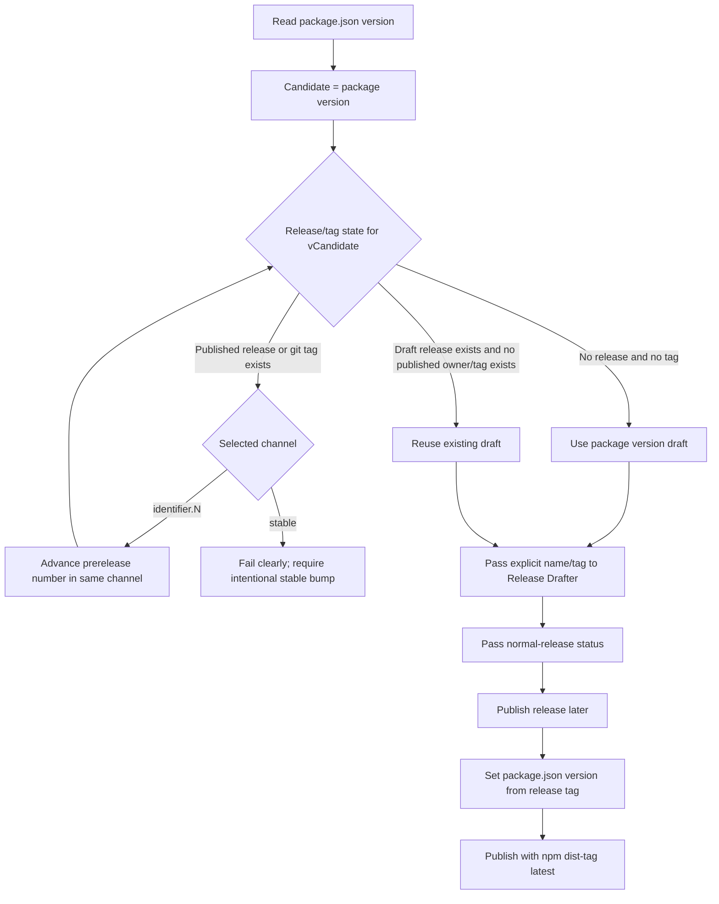

# fix: Select reusable release drafter versions

## Overview

Update the sandbox SDK release automation so Release Drafter starts from `package.json` but does not blindly reuse a version that is already published or already backed by a git tag. When the package version is still represented by an unreleased draft, the workflow should keep updating that draft. When the package version is already owned by a published release or tag, the workflow should choose the next available version in the same release channel and pass it explicitly to Release Drafter.

The publish workflow should then treat the published GitHub release tag as the final npm package version source and publish every SDK release under the npm `latest` dist-tag. Semver prerelease identifiers such as `alpha`, `beta`, or `rc` are version channels only; they should not make the GitHub release a pre-release or move the npm package off `latest`. This prevents a valid drafter-computed tag, such as `v0.1.0-beta.2`, from failing only because the committed `package.json` still says `0.1.0-beta.1`, while also supporting intentional channel switches to any semver prerelease identifier, such as `0.1.0-alpha.1`, `0.1.0-rc.1`, or stable `0.1.0`.

---

## Problem Frame

The current release-drafter workflow reads `package.json` and passes the exact package version as the draft release name and tag. That fixed the earlier drift from Release Drafter's inferred version, but it creates a follow-up problem: once `v<package version>` has been published or otherwise exists as a git tag, new changes merged without a version bump will keep targeting an already-owned tag. It also leaves semver channel configuration split across `package.json`, `.github/release-drafter.yml`, and npm publish behavior. The current static beta config caused a published `0.1.0-beta.1` release to appear as a GitHub pre-release and publish under the npm `beta` dist-tag, but the desired policy is that it is a real SDK release with a beta semver version.

The revised policy should make `package.json` the maintainer-controlled channel selector. If `package.json` says `0.1.0-beta.1`, the drafter stays in beta and advances to `beta.2` when needed. If it says `0.1.0-alpha.1`, `0.1.0-rc.1`, or another numeric prerelease version, the drafter creates or advances drafts in that exact channel. If it says `0.1.0`, the drafter creates a stable `v0.1.0` draft when available. The release workflow also rejects any published release whose tag does not match the committed `package.json` version, so the drafter cannot safely advance the tag unless publish learns to align package metadata from the release tag first.

This plan comes from the `release-drafter-version-selection.md` task handoff note. That note is outside the repo, so this plan does not link it as a repo path and keeps implementation paths repo-relative.

---

## Requirements Trace

- R1. Use `package.json` as the preferred starting version and release channel selector for release drafts.
- R2. If an unreleased draft already exists for `v<package version>`, continue updating that draft instead of creating a new version.
- R3. If a published release or existing git tag already owns `v<package version>`, choose the next available draft version in the same channel and pass explicit `name` and `tag` values to Release Drafter.
- R4. If no release or tag owns `v<package version>`, draft the package version directly.
- R5. Publish should use the GitHub release tag as the final npm package version source when the drafter advanced beyond committed `package.json`.
- R6. Keep the change scoped to release automation and validate the workflow logic with local scriptable checks where practical.
- R7. Support intentional channel switches from `package.json`, including continuation in the current channel, arbitrary numeric prerelease channels, and stable releases.
- R8. Publish every SDK release under the npm `latest` dist-tag, regardless of whether the semver version contains a prerelease identifier.
- R9. GitHub releases should be normal releases, not GitHub pre-releases, regardless of whether the semver version contains a prerelease identifier.
- R10. Optionally provide a manual repair path that accepts a release tag, verifies it exists, and moves npm `latest` to the corresponding already-published package version without republishing.

---

## Scope Boundaries

- Do not change the SDK runtime API, generated proto code, package exports, npm package name, or publish access settings.
- Do not introduce production service calls, database access, or environment changes outside GitHub Actions release automation.
- Do not require maintainers to manually bump `package.json` for every prerelease draft when Release Drafter can compute the next available tag in the selected channel.
- Do not replace Release Drafter with a different changelog/release tool.
- Do not publish, create, delete, or mutate real GitHub releases while implementing local tests.
- Do not auto-switch from one prerelease channel to another without a committed `package.json` version selecting that channel.
- Do not automatically advance consumed stable versions to a new stable patch unless the behavior is explicitly designed and documented; stable version reuse should fail clearly or require an intentional version bump.
- Do not use semver prerelease identifiers to mark GitHub releases as pre-releases.
- Do not publish semver prerelease versions under npm dist-tags like `alpha`, `beta`, or `rc`; all SDK releases should update `latest`.
- Do not rerun `npm publish` for an already-published npm version as part of repair; npm package versions are immutable once published.

---

## Context & Research

### Relevant Code and Patterns

- `.github/workflows/release-drafter.yml` already checks out the repo, reads `package.json`, and passes explicit `name` and `tag` inputs to `release-drafter/release-drafter@v6`.
- `.github/release-drafter.yml` currently includes static beta pre-release config plus the release-note template.
- `.github/workflows/release.yml` checks out `refs/tags/${{ github.event.release.tag_name }}`, runs `pnpm run validate`, enforces exact tag/package version equality, then runs `npm publish --access public`.
- `package.json` currently has `publishConfig.tag: "beta"`, which makes `npm publish` use the `beta` dist-tag unless the workflow overrides or removes it.
- `README.md` documents the old rule that the GitHub release tag must match committed `package.json`.
- Existing tests use Node's built-in test runner through `tsx --test src/*.test.ts`; release workflow logic can use a `.mjs` script plus `node --test` without adding dependencies.

### Institutional Learnings

- No repo-local `docs/solutions/` learnings exist for this worktree.

### External References

- Release Drafter's official action docs state that action inputs such as `name`, `tag`, `version`, and `prerelease` override configured/calculated values. Since this repo computes exact tags itself, it should not need Release Drafter's `prerelease-identifier` version calculation, and it should pass or configure `prerelease: false`.
- GitHub's REST release docs distinguish "Get a release by tag name" as a published-release endpoint, so draft detection should not rely only on that endpoint. Version selection should consider listed releases, including drafts available to the authenticated workflow token, and git tag existence separately.
- npm's official `npm version` docs state that git tag/commit creation can be disabled with `--no-git-tag-version`, which is the right posture for publish-time package metadata alignment because the release tag already exists.
- npm's official dist-tag docs state that `npm publish --tag <tag>` selects the distribution tag. That supports explicitly publishing with `--tag latest` so static `publishConfig.tag: beta` cannot keep real SDK releases off `latest`.
- npm's official dist-tag docs define `npm dist-tag add` as the command to move a dist-tag to an already-published version. This is a package metadata mutation, not a package publish.
- npm trusted publishing docs confirm the current OIDC-based publishing shape; the existing `id-token: write` permission and tokenless publish model should remain intact.

---

## Key Technical Decisions

- Add a small, tested resolver script instead of embedding all branching logic inline in YAML: workflow expression syntax and shell conditionals are hard to test, while a script can accept mocked release/tag state locally and run in CI without new dependencies.
- Treat draft releases, published releases, and git tags as separate ownership signals: a matching draft should be reused only when the candidate is not already owned by a published release or git tag; a matching published release or tag should force version advancement.
- Keep `package.json` as the first candidate, not as the only valid release version: this preserves intentional package-version PRs while allowing automation to advance when the committed version has already been consumed.
- Make advancement channel-aware, not beta-specific: for `alpha.N`, `beta.N`, or another numeric prerelease channel, increment `N` and keep the same identifier; for a stable version, draft that exact stable version when available and fail clearly when consumed unless a future requirement explicitly permits automated stable patch advancement.
- Keep GitHub release status independent from semver prerelease identifiers: Release Drafter should create/update normal draft releases with `prerelease: false` for `alpha`, `beta`, `rc`, and stable versions.
- Align `package.json` from `github.event.release.tag_name` before validation and `npm publish`: validation and packaging should see the same version npm will publish, without creating a new commit or tag.
- Publish every version with npm dist-tag `latest`. Use an explicit `npm publish --tag latest` and remove or override static `publishConfig.tag: beta`.

---

## Open Questions

### Resolved During Planning

- Should this plan use `package.json` or Release Drafter's inferred `$RESOLVED_VERSION` as the starting point? Use `package.json`; the task note explicitly preserves it as the preferred starting version.
- Should publish reject drafter-computed tags that differ from committed `package.json`? No; the task note explicitly says publish should use the GitHub release tag as the final npm package version source.
- Should matching draft releases be considered reusable even if no git tag exists yet? Yes; an unreleased draft for the package version is the desired update target.
- Should channel switches be supported by changing `package.json`? Yes; a committed `package.json` version such as `0.1.0-alpha.1`, `0.1.0-rc.1`, or `0.1.0` should select that exact prerelease or stable workflow instead of being forced back to beta.
- Should stable versions auto-advance when consumed? No for this plan; stable patch advancement is a separate release policy decision. A consumed stable package version should fail clearly and ask for an intentional version bump.
- Should semver prerelease versions become GitHub pre-releases? No; `0.1.0-beta.1` is still a real SDK release and should publish as a normal GitHub release.
- Should semver prerelease versions publish under matching npm dist-tags? No; every SDK release should update `latest`.
- Can the already-published `0.1.0-beta.1` be repaired by rerunning the release workflow? No; npm will reject a duplicate publish for the same package version.
- Can the already-published `0.1.0-beta.1` be repaired without republishing? Yes; a manual repair flow can verify the supplied release tag exists, update the GitHub release metadata, and move npm `latest` to the existing version with `npm dist-tag add`.

### Deferred to Implementation

- Exact GitHub API pagination and authentication mechanics for listing draft releases: implementation should use the workflow token already available to Release Drafter and cover the resolver's pure selection behavior locally.
- Whether the final workflow uses a script mode, GitHub API helper, or workflow step wrapper around the resolver: choose the smallest maintainable implementation that keeps the selection logic tested.

---

## High-Level Technical Design

> _This illustrates the intended approach and is directional guidance for review, not implementation specification. The implementing agent should treat it as context, not code to reproduce._

---

## Implementation Units

- U1. **Add release draft version resolver**

**Goal:** Create tested release-version selection logic that chooses the package version, an existing reusable draft, or the next available version in the selected semver prerelease channel based on release/tag ownership.

**Requirements:** R1, R2, R3, R4, R6, R7

**Dependencies:** None

**Files:**

- Create: `scripts/resolve-release-drafter-version.mjs`
- Create: `scripts/resolve-release-drafter-version.test.mjs`
- Modify: `package.json`

**Approach:**

- Implement a dependency-free Node script with a pure resolver core that can be tested from fixture data and a workflow-facing mode that can read `package.json` and repository release/tag state.
- Define ownership precedence clearly: a draft release for a candidate allows reuse only if that candidate is not already owned by a published release or matching git tag; published releases and tags block reuse and advance to the next candidate.
- Keep advancement channel-aware: increment the numeric prerelease suffix for the identifier selected by `package.json`; do not switch identifiers unless `package.json` changes.
- For stable versions, draft the exact stable candidate when it is available and fail clearly when it is consumed; do not silently turn a consumed stable version into a prerelease or patch release.
- Emit workflow-ready release metadata: version, tag, release name, GitHub release pre-release status set to false, and npm dist-tag set to `latest`.
- Add a scriptable test entry to `package.json` so the resolver test can run in local validation without changing SDK behavior.

**Execution note:** Implement the resolver test-first, because the value of this change is mostly in edge-case policy rather than YAML syntax.

**Patterns to follow:**

- Use the dependency-free Node script style from `scripts/check-generated.mjs`.
- Use Node's test runner style already exercised by `package.json` scripts.

**Test scenarios:**

- Happy path: package version `0.1.0-beta.1` with no matching releases or tags resolves to `0.1.0-beta.1` and tag `v0.1.0-beta.1`.
- Happy path: package version `0.1.0-beta.1` with an existing draft release for `v0.1.0-beta.1` and no git tag resolves to `0.1.0-beta.1`.
- Edge case: package version `0.1.0-beta.1` with a published release for `v0.1.0-beta.1` resolves to `0.1.0-beta.2`.
- Edge case: package version `0.1.0-beta.1` with a git tag for `v0.1.0-beta.1` but no release resolves to `0.1.0-beta.2`.
- Edge case: package version `0.1.0-beta.1` with both a draft release and a git tag for `v0.1.0-beta.1` treats the tag as consumed and resolves to `0.1.0-beta.2`.
- Edge case: package version `0.1.0-beta.1` with consumed candidates `v0.1.0-beta.1` and `v0.1.0-beta.2` resolves to `0.1.0-beta.3`.
- Happy path: package version `0.1.0-alpha.1` with no matching releases or tags resolves to `0.1.0-alpha.1`, keeps GitHub release pre-release status false, and uses npm dist-tag `latest`.
- Edge case: package version `0.1.0-alpha.1` with consumed candidate `v0.1.0-alpha.1` resolves to `0.1.0-alpha.2` without touching beta candidates.
- Edge case: package version `0.1.0-rc.1` with consumed candidate `v0.1.0-rc.1` resolves to `0.1.0-rc.2` and uses npm dist-tag `latest`.
- Happy path: package version `0.1.0` with no matching releases or tags resolves to stable `0.1.0`, keeps GitHub release pre-release status false, and uses npm dist-tag `latest`.
- Error path: package version `0.1.0` with existing published release or tag for `v0.1.0` fails clearly instead of auto-advancing to `0.1.1`.
- Error path: malformed or missing package version fails with a clear error and does not emit a misleading draft tag.

**Verification:**

- Resolver tests prove all three task-note cases and the repeated-candidate case.
- The script emits workflow-ready values for release name, version, tag, normal GitHub release status, and npm `latest` dist-tag without modifying files.

---

- U2. **Wire resolver into release-drafter workflow**

**Goal:** Update the release-drafter workflow so it passes the resolver-selected version to Release Drafter and always creates a normal GitHub release draft instead of inheriting static beta pre-release config.

**Requirements:** R1, R2, R3, R4, R6, R7

**Dependencies:** U1

**Files:**

- Modify: `.github/workflows/release-drafter.yml`
- Test: `scripts/resolve-release-drafter-version.test.mjs`

**Approach:**

- Replace the current "Read package version" step with a resolver step that determines the draft version from `package.json`, draft releases, published releases, and git tag state.
- Keep Release Drafter configured with explicit `name`, `tag`, `version`, and `prerelease: false` inputs, using the resolver outputs for identity and a fixed normal-release status.
- Preserve the existing workflow trigger, permissions, checkout, and `BOT_PUBLIC_GITHUB_TOKEN` usage unless implementation proves the resolver needs the token exposed to its own step as well.
- Move or override static beta-specific config so `.github/release-drafter.yml` cannot force any semver prerelease package version into GitHub pre-release behavior.
- Avoid moving version templates back into `.github/release-drafter.yml`; the workflow should remain the single place that decides release identity.

**Patterns to follow:**

- Existing `.github/workflows/release-drafter.yml` output-to-Release-Drafter pattern.
- Existing `.github/release-drafter.yml` separation between note template config and release identity, after removing or overriding static beta pre-release status.

**Test scenarios:**

- Integration: mocked resolver state for a free package version leads to Release Drafter inputs `name: @depot/sandbox <package version>` and `tag: v<package version>`.
- Integration: mocked resolver state for a consumed package version leads to Release Drafter inputs using the advanced version and tag.
- Integration: mocked prerelease package versions lead to Release Drafter normal-release inputs, not GitHub pre-release status.
- Integration: mocked stable package version also leads to Release Drafter normal-release inputs.
- Error path: resolver failure should fail the release-drafter job before Release Drafter creates or updates a draft with a stale/ambiguous tag.

**Verification:**

- Workflow YAML still points Release Drafter at explicit resolver outputs.
- The release-drafter config remains focused on release-note body configuration rather than hard-coded version/channel or pre-release status policy.

---

- U3. **Align publish package version from release tag**

**Goal:** Make published GitHub release tags authoritative for the npm package version, and ensure every publish updates npm `latest`.

**Requirements:** R5, R6, R8

**Dependencies:** U1

**Files:**

- Modify: `.github/workflows/release.yml`
- Create: `scripts/set-package-version-from-release-tag.mjs`
- Create: `scripts/set-package-version-from-release-tag.test.mjs`
- Modify: `package.json`

**Approach:**

- Replace the strict tag/package equality gate with a release-tag validation and package metadata alignment step.
- Validate that `github.event.release.tag_name` starts with `v` and contains a valid package version after stripping the prefix.
- Update `package.json` to that stripped version before `pnpm run validate`, using a small script or no-commit/no-tag npm approach so the checked-out release tag remains unchanged.
- Publish with an explicit `--tag latest` so the workflow is not constrained by `publishConfig.tag: beta`.
- Remove `publishConfig.tag: "beta"` from `package.json` or override it consistently in the workflow so local/manual publish guidance does not contradict CI.
- Keep npm trusted publishing unchanged: `id-token: write`, `setup-node` registry config, and `npm publish --access public` should stay intact.

**Patterns to follow:**

- Existing `.github/workflows/release.yml` tag checkout and validation-before-publish ordering.
- Dependency-free Node script patterns from `scripts/check-generated.mjs`.
- npm's documented no-git-tag version update mode if implementation chooses npm for metadata alignment rather than direct JSON update.
- npm's documented `npm publish --tag <tag>` dist-tag selection.

**Test scenarios:**

- Happy path: release tag `v0.1.0-beta.2` updates package metadata to `0.1.0-beta.2` before validation/publish even when committed `package.json` contains `0.1.0-beta.1`.
- Happy path: release tag `v0.1.0-alpha.1` updates package metadata to `0.1.0-alpha.1` and publishes with npm dist-tag `latest`.
- Happy path: release tag `v0.1.0-rc.1` updates package metadata to `0.1.0-rc.1` and publishes with npm dist-tag `latest`.
- Happy path: release tag `v0.1.0` updates package metadata to `0.1.0` and publishes with npm dist-tag `latest`.
- Happy path: release tag matching committed `package.json` remains valid and does not change publish semantics.
- Error path: release tag without a leading `v` fails before validation/publish.
- Error path: release tag with an invalid version fails before validation/publish.
- Error path: missing or unreadable `package.json` fails before validation/publish.
- Integration: package validation and dry-run package checks operate on the tag-derived version, not the stale committed version.
- Integration: `npm publish` receives explicit `--tag latest` rather than relying on `publishConfig.tag`.

**Verification:**

- The publish job no longer rejects drafter-computed tags solely because committed `package.json` is behind.
- Prerelease and stable release tags publish under npm dist-tag `latest`.
- Invalid release tags still stop before npm publish.

---

- U4. **Update release documentation**

**Goal:** Document the revised release policy so maintainers understand when `package.json` is a starting point and semver channel selector versus when the GitHub release tag becomes authoritative.

**Requirements:** R1, R2, R3, R4, R5, R7, R8, R9

**Dependencies:** U2, U3

**Files:**

- Modify: `README.md`

**Approach:**

- Update the releasing section to describe the three release-drafter cases from the task note.
- Explain that maintainers may intentionally bump `package.json` to continue the current prerelease channel, switch to another prerelease identifier, or prepare a stable release.
- Explain that if maintainers merge changes after a prerelease version is already published/tagged, Release Drafter can advance the draft tag within that same selected channel.
- Clarify that publishing a GitHub release tagged `v<release-version>` causes the publish workflow to set the npm package version from that tag before validation and publish under `latest`.
- Clarify that semver prerelease identifiers do not mean GitHub pre-release status for this package.
- Keep the npm trusted publishing note intact, but update any examples that imply beta is a special npm dist-tag.

**Patterns to follow:**

- Existing concise `README.md` release instructions.

**Test scenarios:**

- Test expectation: none -- documentation-only change.

**Verification:**

- Release docs no longer state that the published release tag must always match committed `package.json`.
- The documented process covers existing draft reuse, consumed package-version advancement, intentional package-version/channel bumps, tag-derived publish, normal GitHub release status, and `latest` dist-tag behavior for prerelease and stable semver versions.

---

- U5. **Add optional release metadata repair workflow**

**Goal:** Provide a manual `workflow_dispatch` path that repairs an operator-specified release tag by clearing GitHub pre-release status and moving npm `latest` to that tag's already-published package version.

**Requirements:** R8, R9, R10

**Dependencies:** None

**Files:**

- Create: `.github/workflows/repair-release-metadata.yml`

**Approach:**

- Add a manual-only workflow with a required `tag` input, for example `v0.1.0-beta.1`.
- Validate that the input starts with `v` and strip it to derive the package version; do not accept a separate package-version input that could drift from the tag.
- Verify the GitHub release for the supplied tag exists before any npm mutation. If needed, also verify the git tag exists so the workflow cannot repair a release detached from repo history.
- Verify the npm package version already exists before moving `latest`, using a read-only registry lookup such as `npm view @depot/sandbox@<version> version`.
- Use GitHub's releases API with `GITHUB_TOKEN` and `contents: write` permission to patch the existing GitHub release to `prerelease: false`.
- Use `npm dist-tag add @depot/sandbox@<version> latest` to move npm `latest` to the verified already-published version.
- Require an npm automation/granular token secret for the dist-tag mutation if trusted publishing does not authenticate `npm dist-tag add`; do not assume OIDC publish credentials cover post-publish tag mutation.
- Do not run `npm publish` from this workflow.
- Keep the workflow as an operator-only repair tool; it can remain useful for future metadata repair but should not run automatically.

**Patterns to follow:**

- Existing GitHub Actions YAML style in `.github/workflows/release.yml`.
- npm's documented `npm dist-tag add` command for moving a dist-tag to an existing version.

**Test scenarios:**

- Happy path: workflow input `v0.1.0-beta.1` verifies the GitHub release exists, verifies npm package version `0.1.0-beta.1` exists, patches the GitHub release to normal release status, and runs `npm dist-tag add @depot/sandbox@0.1.0-beta.1 latest`.
- Happy path: workflow input for a future valid tag, such as `v0.1.0-beta.2`, repairs that version without code changes to the workflow.
- Error path: tag input without leading `v` fails before GitHub or npm mutation.
- Error path: supplied GitHub release tag does not exist, so the workflow fails before npm mutation.
- Error path: npm package version derived from the tag does not exist, so the workflow fails before moving `latest`.
- Error path: missing npm token secret fails before attempting dist-tag mutation and does not run `npm publish`.

**Verification:**

- The workflow is manual-only and cannot run on push or release events.
- The workflow contains no `npm publish` command.
- After a successful run for a supplied tag, that GitHub release is not marked pre-release and npm `latest` points at the package version derived from the tag.

---

## System-Wide Impact

- **Interaction graph:** Merges to `main` trigger `.github/workflows/release-drafter.yml`; publishing a GitHub release triggers `.github/workflows/release.yml`; npm trusted publishing remains the final external publish step.
- **Error propagation:** Resolver ambiguity or invalid versions should fail before Release Drafter mutates draft state; invalid publish tags should fail before validation and npm publish.
- **State lifecycle risks:** Draft releases may exist without corresponding git tags; published releases and tags are durable ownership signals that must not be reused for new drafts.
- **API surface parity:** No SDK API or package export changes are expected.
- **Integration coverage:** Local fixture tests cover resolver policy; workflow review covers YAML wiring; no tests should call real GitHub release mutation APIs.
- **Unchanged invariants:** Release Drafter remains the release-note tool, npm trusted publishing remains tokenless via OIDC, channel changes require an intentional `package.json` version change, and every publish should update npm `latest`.

---

## Risks & Dependencies

| Risk                                                                                    | Mitigation                                                                                                                                                  |
| --------------------------------------------------------------------------------------- | ----------------------------------------------------------------------------------------------------------------------------------------------------------- |
| Draft detection misses existing drafts and creates duplicate draft versions.            | Query/list release state with authenticated workflow credentials and test the pure resolver behavior for draft reuse.                                       |
| Resolver advances to a version that is already tagged because it only checks releases.  | Treat git tag existence as a separate blocking signal from release existence.                                                                               |
| Static beta config marks real releases as GitHub pre-releases.                          | Remove or override static pre-release config; pass normal-release status from the workflow.                                                                 |
| Releases accidentally publish under a stale npm dist-tag.                               | Use explicit `npm publish --tag latest` and remove or override `publishConfig.tag: beta`.                                                                   |
| One-off repair workflow requires npm auth that OIDC may not provide for `dist-tag add`. | Use a short-lived/granular npm token secret for the repair workflow, or perform the npm dist-tag command manually from an authenticated maintainer machine. |
| Publish-time package mutation accidentally creates commits or tags.                     | Use a no-commit/no-tag package metadata update path and keep the checkout at the release tag.                                                               |
| Workflow logic becomes hard to maintain in YAML.                                        | Put branching logic in a small script with local tests; keep YAML as orchestration.                                                                         |
| Semver edge cases beyond numeric prerelease channels are underspecified.                | Support numeric prerelease identifiers such as `alpha.1`, `beta.1`, and `rc.1`; fail clearly on unsupported malformed inputs.                               |

---

## Documentation / Operational Notes

- Maintainers should review the draft release tag and channel before publishing, especially after no-version-bump merges where automation advances the tag.
- To switch channels, maintainers intentionally merge a `package.json` version selecting the new channel, such as `0.1.0-alpha.1`, `0.1.0-rc.1`, `0.1.0-beta.3`, or `0.1.0`.
- GitHub releases should be published as normal releases, not pre-releases, even when the semver version includes a prerelease identifier.
- npm publishes should update `latest` for every release.
- The publish job should continue to require npm trusted publishing configuration for `depot/sandbox-sdk` and `.github/workflows/release.yml`.
- No rollout or migration is needed beyond merging the workflow changes; behavior starts on the next push to `main` and the next published GitHub release.

---

## Sources & References

- Origin task note: `release-drafter-version-selection.md` task handoff outside this repo
- Related prior task note: `release-drafter-package-version.md` task handoff outside this repo
- Related workflow: `.github/workflows/release-drafter.yml`
- Related workflow: `.github/workflows/release.yml`
- Related config: `.github/release-drafter.yml`
- Release docs: `README.md`
- External docs: [Release Drafter action inputs and outputs](https://github.com/release-drafter/release-drafter)
- External docs: [GitHub REST releases API](https://docs.github.com/v3/repos/releases)
- External docs: [npm version command](https://docs.npmjs.com/cli/v11/commands/npm-version/)
- External docs: [npm dist-tags](https://docs.npmjs.com/cli/v11/commands/npm-dist-tag/)
- External docs: [npm trusted publishing](https://docs.npmjs.com/trusted-publishers/)
